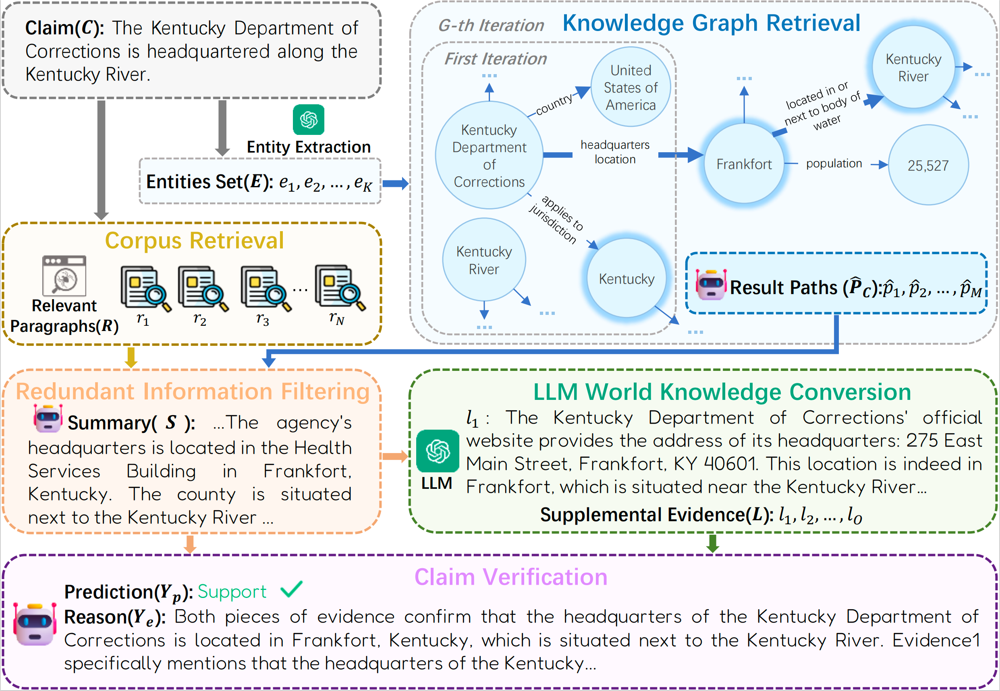

# IMRRF
Codes for NAACL 2025 Paper [IMRRF: Integrating Multi-Source Retrieval and Redundancy Filtering for LLM-based Fake News Detection](https://aclanthology.org/2025.naacl-long.461/)
# Introduction
The widespread use of social networks has significantly accelerated the dissemination of information but has also facilitated the rapid spread of fake news, leading to various negative consequences. Recently, with the emergence of large language models (LLMs), researchers have focused on leveraging LLMs for automated fake news detection. Unfortunately, many issues remain to be addressed. First, the evidence retrieved to verify given fake news is often insufficient, limiting the performance of LLMs when reasoning directly from this evidence. Additionally, the retrieved evidence frequently contains substantial redundant information, which can interfere with the LLMs’ judgment. To address these limitations, we propose a Multiple Knowledge Sources Retrieval and LLM Knowledge Conversion framework, which enriches the evidence available for claim verification. We also introduce a Redundant Information Filtering Strategy, which minimizes the influence of irrelevant information on the LLM reasoning process. Extensive experiments conducted on two challenging fact-checking datasets demonstrate that our proposed method outperforms state-of-the-art fact-checking baselines.

First, install all the required packages:

